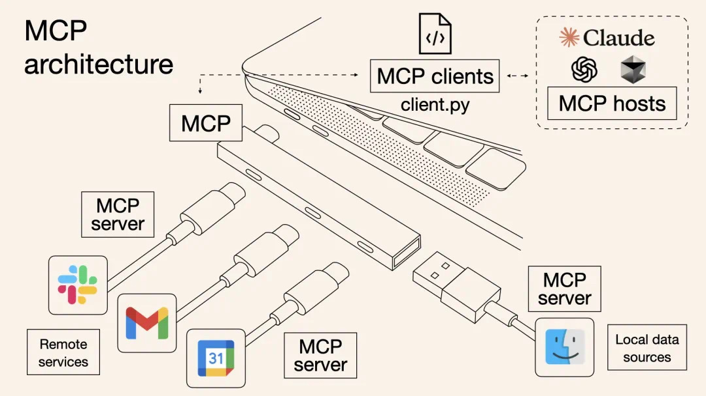

# MCP Servers

Repositório com múltiplos servidores MCP (Model Context Protocol) para possibilitar a integração de ferramentas de IA.

## Objetivo

- Centralizar servidores MCP prontos para uso em diferentes tecnologias
- Facilitar a configuração no Cursor via `.cursor/settings.json`

## Índice de Servidores

- MySQL: [mcp_mysql](./mcp_mysql)
  - Servidor MCP para consultas seguras em MySQL
- PostgreSQL: [mcp_postgres](./mcp_postgres)
  - Servidor MCP para consultas seguras em PostgreSQL (inclui CTEs, schemas e SSL)

## Como começar

Acesse o README de cada servidor para instruções detalhadas de instalação, configuração por workspace no Cursor (`.cursor/settings.json`) e exemplos de uso:

- [📁 README MCP MySQL](./mcp_mysql/README.md)
- [📁 README MCP Postgres](./mcp_postgres/README.md)

## Licença

ISC License
